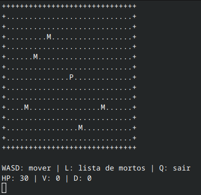

# cpp_endgame
Último jogo feito durante o segundo semestre da faculdade.
## Arquivo de download do [simulador_II.exe](https://github.com/geeyk/cpp_endgame/raw/main/exe_files/simulador_II)
# Mapa
## Caracteres e aparência
Como cada espaço do mapa é representado é ditado por cractéres definidos, sendo eles:
### Bordas:
```txt
+
```
### Espaços vazios:
```txt
.
```
### Monstros:
```txt
M
```
### Jogador:
```txt
P
```
### Imagem de exemplo:


## Testes do mapa descritos em #2
- [x] Identificação Visual
  - [x] Jogador representado por caractere diferente (ex: 'J')
  - [x] Monstros representados por caractere diferente (ex: 'M')
  - [x] Terreno vazio claramente identificado
     
## Como funciona:
### Definição do mapa
O mapa é definido seguindo constantes declaradas nas linhas 77-78 do arquivo [simulador_II.cpp]()

```cpp
const int MAP_WIDTH  = 30;
const int MAP_HEIGHT = 15;
```


# Funcções extras usadas no trabalho
## `_getch()`:
### Windows
Para evitar que o usuário tenha que clicar em ***Enter*** toda a vez após uma tecla de movimentação para mover-se, foi utilizada a biblioteca `conio.h`, que lê o caractere imediatamente sem eco na tela.
### Linux/Mac
Como eu uso Linux para desenvolver, tive que implementar 2 alternativas para ler o caractere pressionado:
Foi necessário desabilitar o modo canônico e o eco do terminal usando as funções `tcgetattr` e `tcsetattr` do cabeçalho `<termios.h`.
Essa adaptação acontece dentro da função `getKeyPress()`.
## `system("cls")` ou `system("clear")`:
### `CLS`
A macro `CLS` é definida como `"cls"` no *Windows* e `"clear"` nos demais sistemas (*Linux* e *Mac*).
### `system()`
Foi a mais simples de implementar, mas fui instruido que não é uma solução muito profissional e não é considerada boa prática. Ela roda um comando no terminal, funciona mas é lenta e depende do sistema operacional.
## `rand()` e `srand()`
Ambas as funções são da biblioteca `<random>`, que aprendi e entendi na faculdade.
### `srand(time(0))`
Inicializa uma seed no gerador usando a hora do sistema, que é obtida através de `time(0)`.
### `rand() % N`
Gera um número entre ***0*** e ***N-1***.
Agora um recado da LLM usada para pesquisa:
>**Atenção:** `rand()` é uma função antiga da biblioteca C, com qualidade limitada. Em projetos futuros, prefira a biblioteca `<random>` do C++11 (`std::mt19937`, `std::uniform_int_distribution`).

Parece bem mais chato de implementar só de olhar pra forma que ela escreveu, mas vou anotar e tentar na próxima.
## `std::this_thread::sleep_for`
